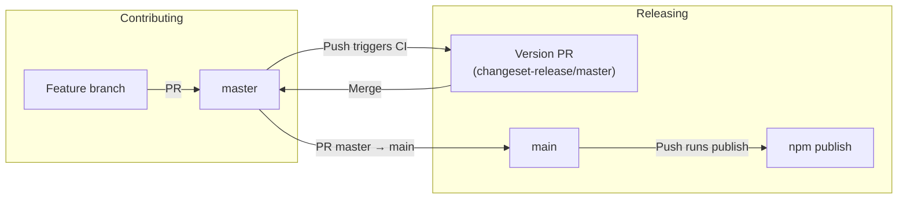

# Contributing

## Branch workflow

- **All PRs target the `master` branch** (release candidate). Do not open PRs directly to `main`.
- **Releases:** A maintainer opens a single PR **master → main** when ready to release. Only that PR can be merged into `main` (enforced by CI and branch protection).



## Making a change

1. **Create a branch** from `master`:
   ```bash
   git fetch origin master
   git checkout -b your-feature origin/master
   ```

2. **Make your changes.** If you change any code under **`packages/`** (published npm packages), you must add a changeset (see below). Changes under `apps/` (e.g. Storybook) do not require a changeset.

3. **Add a changeset** (only when you changed `packages/`):
   ```bash
   pnpm changeset
   ```
   - Select the package(s) affected (e.g. `@deveditor/ui`).
   - Choose bump type: `patch` | `minor` | `major` (see [DESIGN_SYSTEM.md](./DESIGN_SYSTEM.md) for rules).
   - Write a short summary for the changelog.
   - Commit the new `.changeset/*.md` file with your changes.

4. **Open a PR** from your branch **to `master`** (not to `main`). CI will run:
   - Lint, typecheck, build, test.
   - **Changeset required** — fails if you changed `packages/` but did not add a release changeset.

5. After review, your PR is merged into `master`.

## Releasing (maintainers)

1. **Version PR:** CI creates or updates a “chore: version packages” PR from **changeset-release/master** into **master** whenever changes are pushed to `master`. Merge that PR into `master` when you want to bump versions and update changelogs.
2. When `master` is ready for a release, open a PR **master → main**.
3. CI must pass, including **Main only from master** (only the `master` branch can target `main`).
4. Merge the PR. CI on push to `main` will run **publish** (`pnpm run release`: build and publish to npm) and deploy Storybook to GitHub Pages (if configured).

## References

- [.changeset/README.md](./.changeset/README.md) — Changeset workflow and changelog format.
- [DESIGN_SYSTEM.md](./DESIGN_SYSTEM.md) — Design system and versioning rules.
